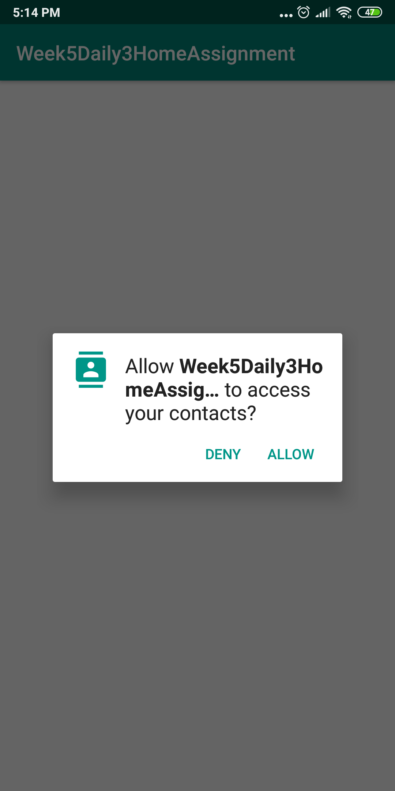
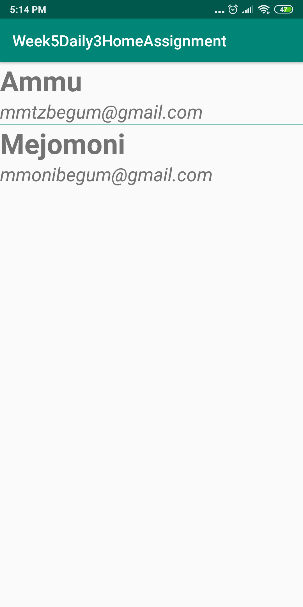
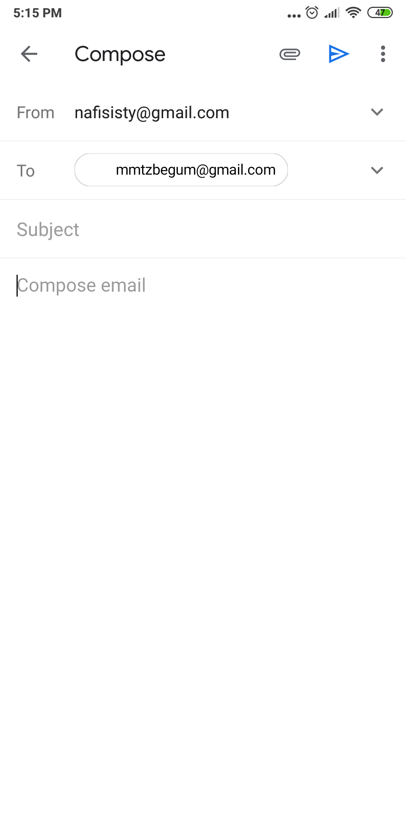

# Week5Daily3HomeAssignment
Create an app that will allow the user to send an email to someone in their contacts that has a email address in the contact entry in the Contacts provider.

Application is asking for permission to user.

Fetched the contracts.

Clicking an item have taken user to default mail app.

